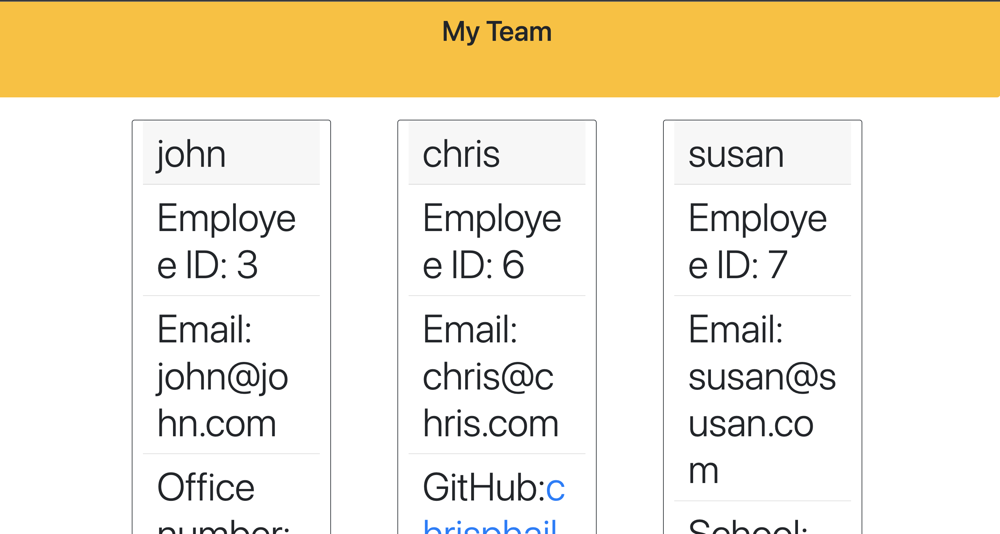

# Profile-Generator
This is a command-line application that takes an input of team roles and personal information and creates a stylized html file with the team profile.

## Usage
Use the following instructions to run the application:
1. Type the command "npm start" to begin the user prompts
2. Fill in the employee's name, ID, and email address
3. Assign a role to the employee (Manager, Engineer or Intern)
4. Continue answering the prompts until all necessary roles have been filled
5. When finished, answer 'n' when asked "Would you like to add another employee?"
6. An index.html file will then be generated in the 'dist' directory

## Screenshot

## URL to Walkthrough Video
